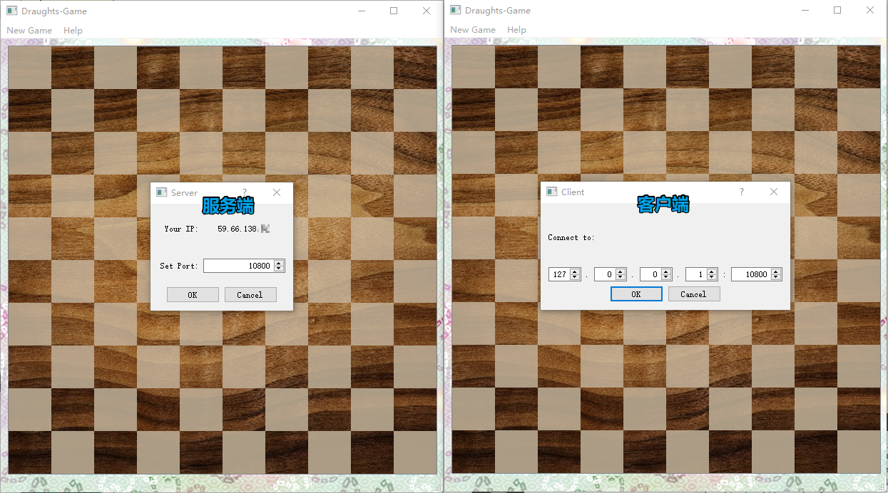
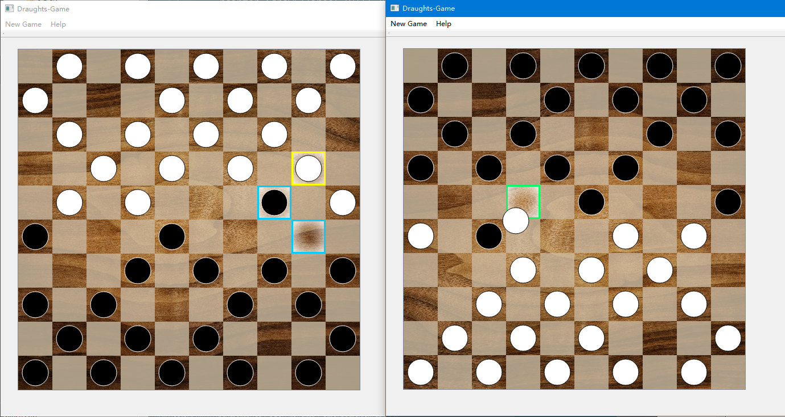
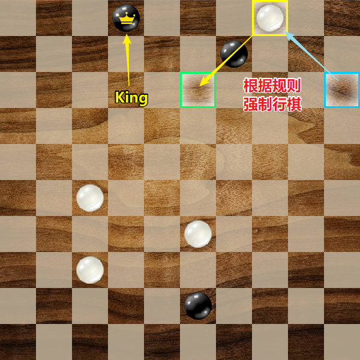

# [Draughts-Game]
Project-Week2 in Summer 2017

*所用音效、音乐、图片素材均来源于网络，版权归原作者所有，侵删。*

## 基本功能实现

- 实现网络对战功能。
    - 显示己方IP，能自定义端口号并进行监听；
    - 能够填写对方IP及端口号并进行连接；
    - 能够实时对对方的走棋在棋盘上做出响应，同时本方的走棋对方也能看到。

- 实现完整功能的国际跳棋。

- 认输与求和功能。
- 音效与bgm。

## 特色功能拓展

- 高亮可行动棋子与可走位置。
- 高亮对手刚刚行动的棋子。
- 用户可通过 drag & drop 来控制棋子，更加直观人性化。

## 主要类介绍

### GameState

保存棋盘状态，并可对当前棋盘可行走法进行搜索。

- 棋盘状态用枚举类型Draughts数组来保存。
- 算法：通过DFS生成一颗包含了当前棋盘所有可能走法的路径树。
    - 和dalao交流之后发现自己的想法和 **[Trie字典树]** 很相似 *~~莫名其妙重新造了遍轮子~~*
- 调用findWays即可获得路径树的根节点。
- 调用move告知GameState棋盘发生了改变。

### GameView

本次Project采用了QGraphicView框架。

- 通过tempo处理Piece类的请求，并与GameState交互。
- 控制音视觉效果。
- initGame可生成默认棋盘或任意指定棋盘。

### Piece

继承自QGraphicsItem类。

- 重写paint函数，根据自身状态绘制自身。
- 监听mousePressEvent与mouseReleaseEvent，向GameView发出行动请求。
  并告知GameView显示相应的VFX。

### Highlights

包括pieceHighlight类, wayHighlight类, traceHighlight类，均为视觉效果。

### BgmThread

播放bgm。

### ServerDlg

服务端的连接对话框。显示己方IP，能自定义端口号并进行监听。

### ClientDlg

客户端的连接对话框。能够填写对方IP及端口号并进行连接。

## 心路历程 & Acknowledgement

这次Project使用了QGraphicsView框架，感觉好用无比！在界面上并没有花费过多的时间。（虽说如此，但还是自己动手画了棋盘和棋子）而且通过该框架实现视觉效果比用StyleSheet不知道高到哪里去了，流畅运行无卡顿。

花时间最多的也不是网络编程……而！是！**算法！！** 从开始理清思路到真正把算法实现花费了一整天的时间 *(非竞赛生是这个样子的QAQ)*，然后和hsr大佬交流后发现自己好像莫名其妙地造了个轮子 *(不懂算法是这个样子的QAQ)* 之后又了解了一些更加高端的姿势，在此表示感谢！ *（这次Project还是按照自己的思路撸了下去，有些重复的代码，不是很妙）*

不过这次Project还是有些不足。比如由于开发时间的紧张，网络通信这一块的鲁棒性并不是很好，以奇奇怪怪的姿势进行网络对战的话很容易崩溃。按照设计的步骤进行游戏还是可以正常运行的。

BGM使用了[Rewrite] OST的《深層森林》。*（用OST的做素材会不会不太好？不过并没有用作商业目的应该没问题吧？）*

SE使用了[freesound]上的免费素材。

 *~~这次好像没有要求写这个玩意？~~*

 [Draughts-Game]: <https://github.com/Ice-Cirno/Draughts-Game>
 [Trie字典树]: <https://zh.wikipedia.org/wiki/Trie>
 [Rewrite]: <http://key.visualarts.gr.jp/rewrite/>
 [freesound]: <http://freesound.org>
